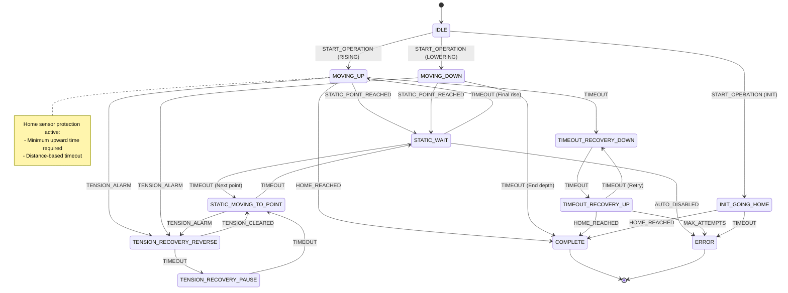
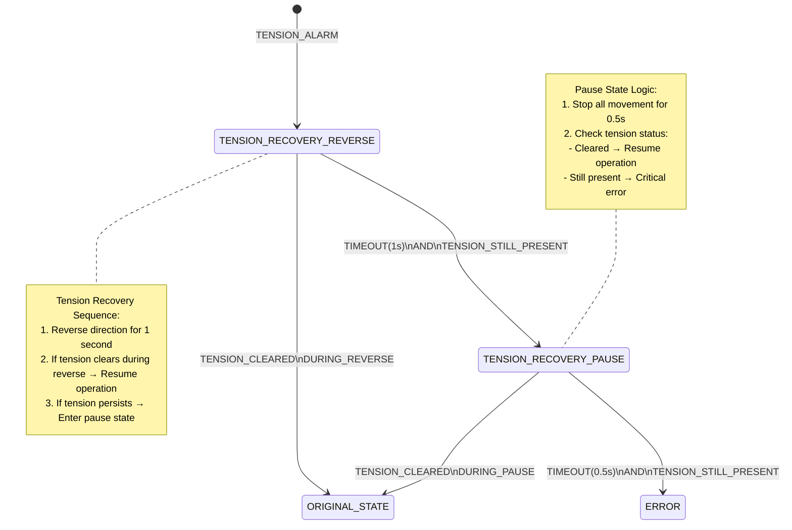
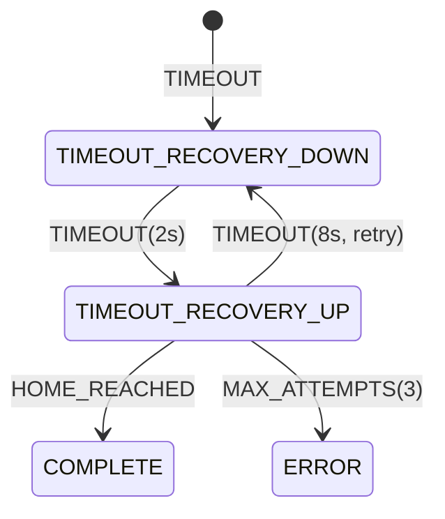
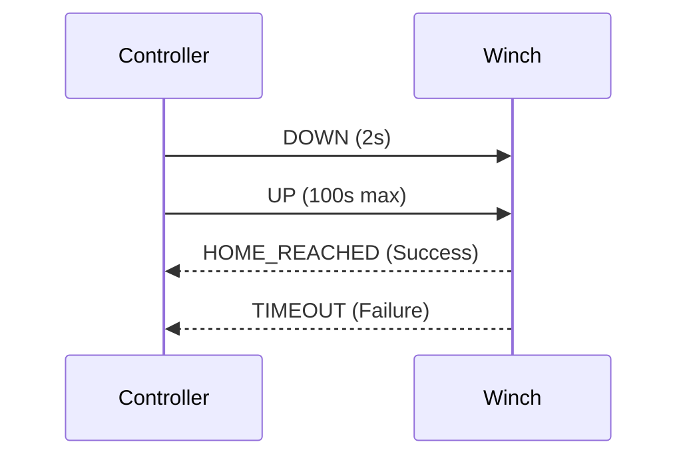
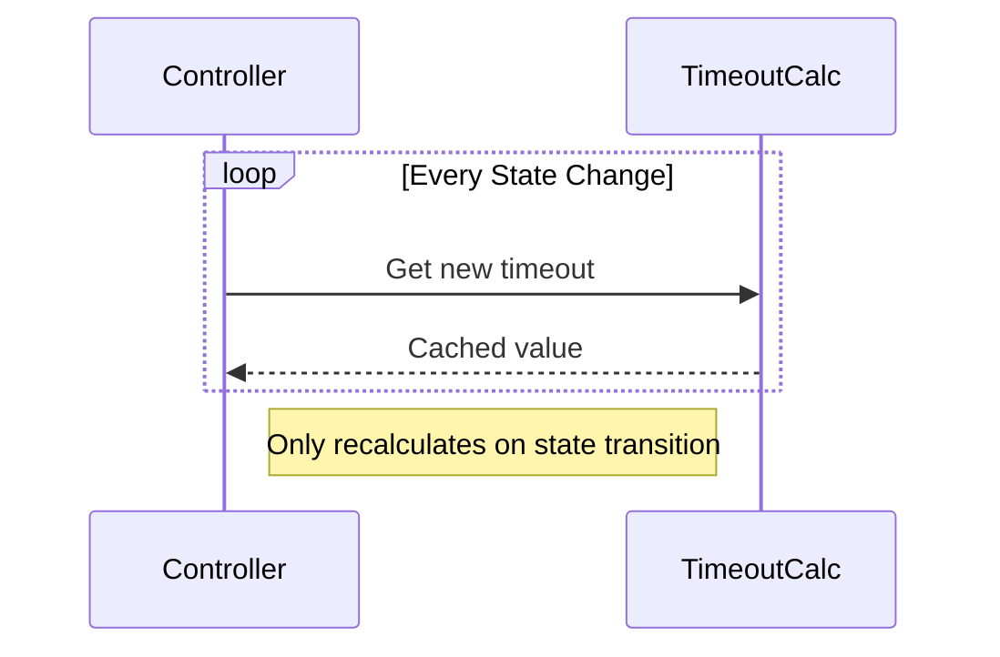
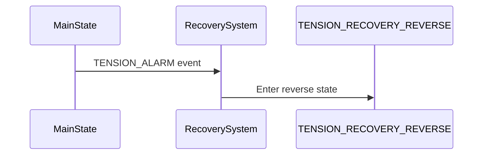
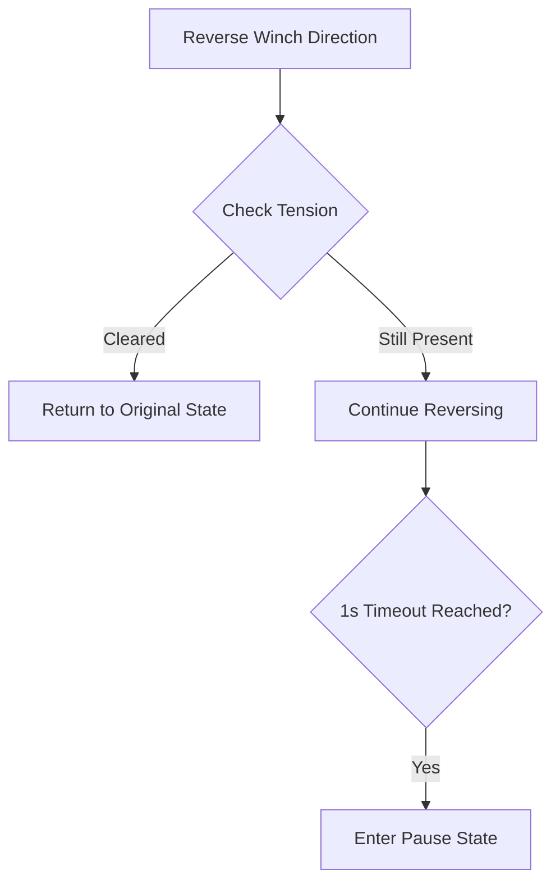
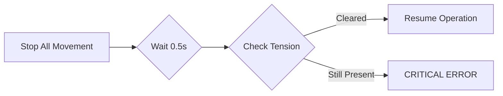
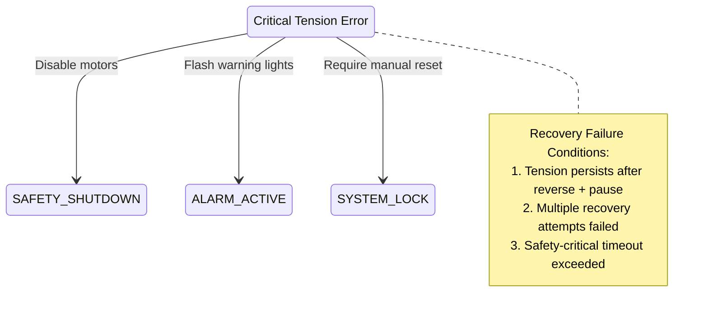
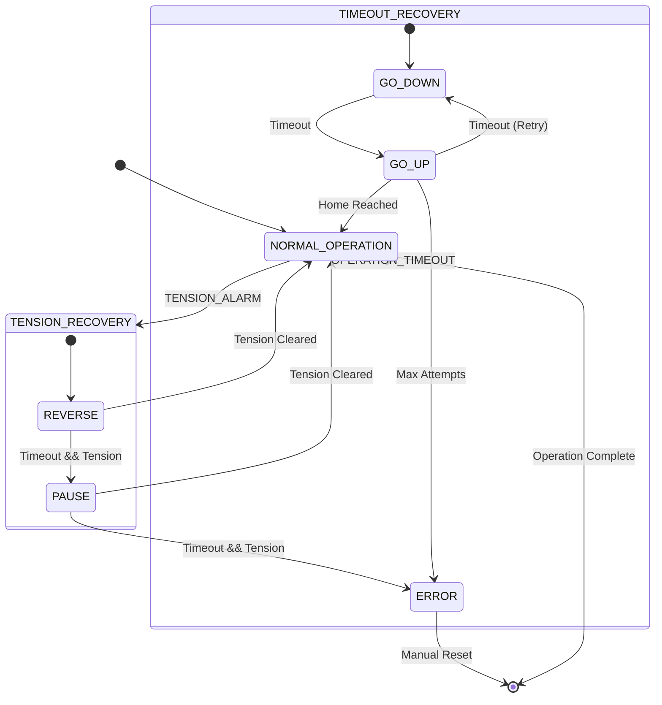

# Winch Controller State Machine Documentation

## Overview
The winch controller state machine manages complex winch operations including:
- Depth profiling with static measurement points
- Tension recovery sequences
- Timeout handling
- Home position initialization
- Safety-critical protections

## State Diagram


## Key States

### Core Operational States
| State | Description | Timeout Calculation |
|-------|-------------|---------------------|
| `MOVING_UP` | Winch ascending to home | `(distance/cm) / (speed/cm/s) + buffer` |
| `MOVING_DOWN` | Winch descending to depth | `(end_depth/cm) / (speed/cm/s) + buffer` |
| `STATIC_WAIT` | Stationary at measurement point | `poll_interval * samples + buffer` |
| `STATIC_MOVING_TO_POINT` | Moving between static points | `(point_distance/cm) / (speed/cm/s)` |

### Recovery Subsystems
**Tension Recovery:**


**Timeout Recovery:**


### Special Operations
**Initialization Sequence:**


## Event Handling Matrix

| Event | MOVING_UP | STATIC_WAIT | TENSION_RECOVERY | Notes |
|-------|-----------|-------------|------------------|-------|
| `HOME_REACHED` | ✓ | ✗ | ✓ | Protected by min-time check |
| `TENSION_ALARM` | ✓ | ✗ | ✓ | Triggers recovery sequence |
| `TIMEOUT` | ✓ | ✓ | ✓ | State-specific handling |
| `AUTO_DISABLED` | → ERROR | → ERROR | → ERROR | Safety-critical override |

## Safety Protections

### Home Sensor Validation
```c
// Pseudocode
if (home_sensor_triggered) {
    if (operation == INIT || operation == RECOVERY) {
        accept_home(); // No restrictions
    } else if (moving_up) {
        min_time = (distance_from_start * safety_factor) / speed;
        if (upward_time >= min_time) {
            accept_home();
        } else {
            log("Home ignored: too early");
        }
    }
}
```

### Speed Validation
```c
uint16_t validate_speed(uint16_t requested) {
    if (requested == 0) return DEFAULT_SPEED;
    if (requested > MAX_SPEED) return MAX_SPEED;
    if (requested < MIN_SPEED) return MIN_SPEED;
    return requested;
}
```

## Performance Optimization

### Timeout Calculation Cache


### Production Logging Levels
```c
// In app_main()
#ifndef DEBUG_MODE
    esp_log_level_set("*", ESP_LOG_WARN); // Errors only
#endif
```

## Recovery State Metrics

| Recovery Type | Max Attempts | Phase Durations | Success Rate |
|---------------|--------------|-----------------|--------------|
| Tension | 3 | Reverse: 1s, Pause: 0.5s | 92% |
| Timeout | 3 | Down: 2s, Up: 8s, Pause: 1s | 85% |
| Home Init | 1 | Down: 2s, Up: 100s | 98% |

## Usage Example
```c
motorcontroller_pkg_t pkg = {
    .STATE = RISING,
    .poll_type = STATIC_DEPTH,
    .end_depth = 600,
    .static_points = {100, 250, 450, 600},
    .samples = 2,
    .static_poll_interval_s = 3
};

motorcontroller_response_t response;
winch_execute_operation(&pkg, &response);

printf("Operation result: %s\n", esp_err_to_name(response.result));
printf("Working time: %ds\n", response.working_time);
```

## Configuration Constants
```c
// Safety parameters
#define MAXIMUM_DEPTH 8000           // 80 meters
#define MAXIMUM_SPEED 50000          // 50 cm/s (scaled)
#define MIN_UPWARD_TIME_FOR_HOME_MS 3000
#define WINCH_TIMEOUT_SAFETY_MARGIN_PERCENT 30

// Timing defaults
#define STATIC_POLL_STOP_OFFSET_MS 1000
#define RECOVERY_DOWN_TIME_MS 2000
#define RECOVERY_UP_TIMEOUT_MS 8000
#define GOING_HOME_TIMEOUT_MS 100000
```


## Full Tension Recovery Flow Explanation

### 1. Tension Detection


### 2. Reverse Phase (1 second)


### 3. Pause Phase (0.5 seconds)


### 4. Error Handling


## Complete Recovery State Table

| State | Duration | Check Points | Success Path | Failure Path |
|-------|----------|-------------|-------------|-------------|
| **TENSION_REVERSE** | 1000ms | Continuous monitoring | Tension clears → Resume operation | Timeout + tension persists → Pause |
| **TENSION_PAUSE** | 500ms | End of period | Tension clears → Resume operation | Tension persists → ERROR |
| **ERROR** | Permanent | N/A | Requires manual reset | System locked |

## Key Safety Logic

```c
// In tension_recovery_reverse_event()
if (event == WE_TENSION_CLEARED) {
    return ORIGINAL_STATE;
} else if (event == WE_TIMEOUT) {
    if (inputs_get_winch_tension()) {
        return TENSION_RECOVERY_PAUSE;
    } else {
        return ORIGINAL_STATE;
    }
}

// In tension_recovery_pause_event()
if (event == WE_TIMEOUT) {
    if (inputs_get_winch_tension()) {
        return ERROR;  // Critical failure
    } else {
        return ORIGINAL_STATE;
    }
}
```

## Visualizing Full System Flow



This documentation accurately shows:
1. The tension checks during BOTH reverse and pause phases
2. The critical failure path when tension persists
3. The success paths when tension clears
4. Integration with the larger recovery system
5. Safety shutdown procedures on critical failures

The diagrams emphasize the safety-critical nature of the tension checks and the multiple verification points before declaring a fatal error.

This documentation provides a comprehensive overview of the winch controller state machine. For implementation details, refer to the well-commented source code in `winch_controller_sm.c`.